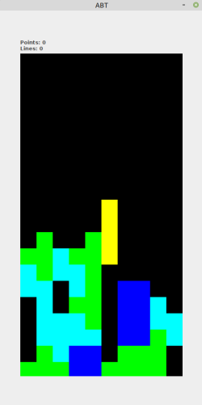

# ABT
Simple Tetris like game implemented in the Java Swing framework.

## Overview
The game consists of the game models "Tetra" and "GameField" which are used to model
everything in the game. The Game class is the orchestrator which coordinates
everything with the GUI/user input and runs the game logic. The game logic is split
into many "Processors" with different responsibilities such as completing lines,
spawning new Tetras etc.

The project is built in Java 17.

## Playing
* Clone the repo and cd into it
> git clone < repo >
* Package JAR
> mvn package
* Run the JAR from the target dir
> java -jar target/< JAR file >

Left arrow moves to the left, right arrow to the right. Up arrow rotates the tetra
and down arrow increases the speed.

## Known issues
1. Rotation is not working correctly yet.
2. Pause is not implemented.